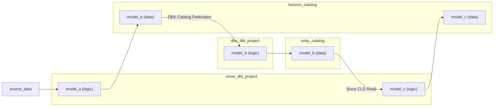

If a model is configured with `catalog_name`, dbt will use the current project's [catalog definition](/docs/build/iceberg/about-catalogs) (in `catalogs.yml`), for the current active adapter, to resolve the top-level namespace of that model.

This means that you can materialize a dbt model in your `databricks_project` to an Iceberg table in Unity catalog, and select from it in another model in your `snowflake_project`. You can even materialize that model back to Unity catalog, and then use it for other models in `databricks_project`.

The requirement is an automated service for linking or syncing metadata across your Iceberg catalog and connected data platforms. These include [Snowflake catalog-linked databases](https://docs.snowflake.com/en/sql-reference/sql/create-database-catalog-linked), [Databricks catalog federation](https://docs.databricks.com/aws/en/query-federation/catalog-federation), [AWS Glue catalog federation](https://docs.aws.amazon.com/lake-formation/latest/dg/catalog-federation.html), and [GCP Lakehouse runtime catalog](https://docs.cloud.google.com/lakehouse/docs/about-lakehouse-catalogs).

Supported cross-platform combinations include:
- Snowflake ↔ Databricks via Unity catalog ([Snowflake docs](https://docs.snowflake.com/en/user-guide/tables-iceberg-configure-catalog-integration-rest-unity), [tutorial](https://docs.snowflake.com/en/user-guide/tutorials/tables-iceberg-set-up-bidirectional-access-to-unity-catalog))
- Snowflake ↔ Athena via Glue catalog ([Snowflake docs](https://docs.snowflake.com/en/user-guide/tables-iceberg-configure-catalog-integration-rest-glue))
- Snowflake ↔ BigQuery via BigLake catalog ([Snowflake docs](https://docs.snowflake.com/en/user-guide/tables-iceberg-configure-catalog-integration-rest-biglake))
- Snowflake ↔ DuckDB via Horizon catalog ([example](https://github.com/dataders/dbt_aws_cloud_cost))
- Databricks ↔ DuckDB via Unity catalog ([example](https://github.com/dataders/dbt_aws_cloud_cost))

## Full example: Snowflake ↔ Databricks via Unity catalog

Let's imagine two "mesh" projects, [`jaffle_finance`](https://github.com/dbt-labs/jaffle-shop-mesh-finance) and [`jaffle_marketing`](https://github.com/dbt-labs/jaffle-shop-mesh-marketing), with a cross-project dependency `jaffle_finance -> jaffle_marketing`.

So long as the `jaffle_finance` project writes its public models to an Iceberg catalog that the `jaffle_marketing` project can read from, and both projects configure that Iceberg catalog in `catalogs.yml` by the same `name` — these projects can now run on **different data platforms.**

```yaml
# jaffle_finance/dbt_project.yml
models:
  jaffle_finance:
    marts:
      access: public
      catalog_name: finance_db

# jaffle_finance/catalogs.yml
catalogs:
  - name: finance_db
    catalog_type: unity
    config:
      databricks:
        # where jaffle_finance project will write its public models to
        catalog_database: finance_db # optional - not required if matches catalog 'name'

# jaffle_marketing/catalogs.yml
catalogs:
  - name: finance_db
    catalog_type: unity
    config:
      snowflake:
        # catalog-linked database pointing to same Unity catalog
        # where jaffle_marketing project will read jaffle_finance public models from
        catalog_database: snowflake_cld__finance_db

# jaffle_marketing/dbt_project.yml
# Unfortunately, Snowflake CLD ↔ Unity catalog requires quoted lowercase schemas + table identifiers
quoting:
  schema: true
  identifier: true
```

What's going on here?

- The `jaffle_finance` project, running on Databricks, will materialize "mart" models into the `finance_db` database in Unity catalog.
- This is actually an Iceberg catalog, which we've made accessible to Snowflake via a catalog-linked database. In Snowflake, the catalog-linked database is named `snowflake_cld__finance_db`.
- When running the `jaffle_marketing` project, dbt sees a cross-project reference to a public model in the `jaffle_finance` project:

```sql
-- marketing/models/marts/roi_by_channel.sql
with monthly_revenue as (

    select * from {{ ref('jaffle_finance', 'monthly_revenue') }}

),

...
```


This will work for [both ways of resolving cross-project references](/docs/mesh/govern/project-dependencies)

1. `package` dependencies (supported in dbt Core + dbt platform)
2. `project` dependencies (dbt platform Enterprise; the advantages of this approach are described [here](/docs/mesh/govern/project-dependencies#advantages))

**For `package` dependencies:**

```yaml
# dependencies.yml
packages:
  - git: https://github.com/dbt-labs/jaffle-shop-mesh-finance
```

The upstream package model `jaffle_finance.monthly_revenue` is configured with `catalog_name: finance_db`. dbt will use the currently running (root) project's `catalogs.yml` to resolve its three-part relation name. In this project (`jaffle_marketing`) + this platform (Snowflake), that catalog is configured with `database: snowflake_cld__finance_db`. Therefore, dbt will resolve the reference to:

**For `project` dependencies:**

```yaml
# dependencies.yml
projects:
  - name: jaffle_finance
```

Previously, if we only used the upstream model's `database` config, then dbt would resolve this to `finance_db.jaffle_finance.monthly_revenue` — which doesn't exist in Snowflake.

Instead, dbt will now **match up the `catalog_name`** for the referenced model with the entries in `catalogs.yml` for the currently running (root) project. dbt will see that `jaffle_finance.monthly_revenue` has `catalog_name: finance_db`, which for this project (`jaffle_marketing`) + this platform (Snowflake) is configured with `database: snowflake_cld__finance_db`. Therefore, dbt will resolve the reference to:

```sql
-- marketing/target/compiled/models/marts/roi_by_channel.sql
with monthly_revenue as (

    select * from snowflake_cld__finance_db."jaffle_finance"."monthly_revenue"

),

...
```

**And it just works!**

Behind the scenes, Snowflake is syncing Databricks' `finance_db` ↔ Snowflake's `snowflake_cld__finance_db`, with eventual consistency. This means that `finance_db.jaffle_finance.monthly_revenue` in Databricks and `snowflake_cld__finance_db."jaffle_finance"."monthly_revenue"` in Snowflake are pointers to *the exact same Iceberg table* in the Databricks-managed Unity catalog.

### Alternative approach: catalog federation

Writes to external Iceberg catalogs are generally slower than writes to managed Iceberg tables, and they can also run into reliability issues at scale. (See our [blog](/blog/catalog-linked-databases) and [benchmark](https://github.com/dbt-labs/snow-dbx-iceberg-benchmark).)

Instead of having Snowflake write directly to Unity catlog, via catalog-linked database. you can have Snowflake write directly to its (managed) Horizon catalog, and use [Databricks catalog federation](https://docs.databricks.com/aws/en/query-federation/catalog-federation) to synchronize the Iceberg metadata for subsequent reads.


