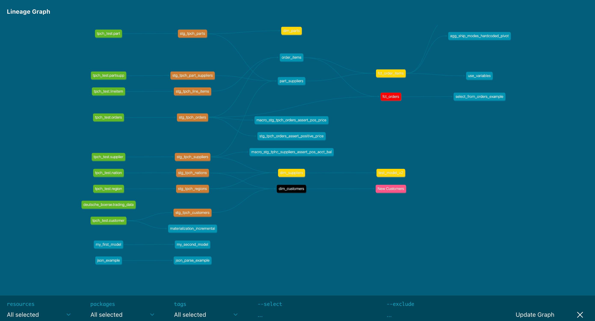

<Tabs
  defaultValue="models"
  values={[
    { label: 'Models', value: 'models', },
    { label: 'Sources', value: 'sources', },
    { label: 'Seeds', value: 'seeds', },
    { label: 'Snapshots', value: 'snapshots', },
    { label: 'Analyses', value: 'analyses', },
    { label: 'Macros', value: 'macros', },
  ]
}>
<TabItem value="models">

<File name='models/schema.yml'>

```yml
version: 2

models:
  - name: model_name
    docs:
      show: true | false

```

</File>

</TabItem>

<TabItem value="sources">

This property is not implemented for sources.

</TabItem>

<TabItem value="seeds">

<File name='seeds/schema.yml'>

```yml
version: 2

seeds:
  - name: seed_name
    docs:
      show: true | false

```

</File>

</TabItem>

<TabItem value="snapshots">

<File name='snapshots/schema.yml'>

```yml
version: 2

snapshots:
  - name: snapshot_name
    docs:
      show: true | false

```

</File>

</TabItem>

<TabItem value="analyses">

<File name='analysis/schema.yml'>

```yml
version: 2

analyses:
  - name: analysis_name
    docs:
      show: true | false
```

</File>

</TabItem>

<TabItem value="macros">

<!----
To-do: check this
--->

<File name='macros/schema.yml'>

```yml
version: 2

macros:
  - name: macro_name
    docs:
      show: true | false

```

</File>

</TabItem>

</Tabs>

## Definition
The docs field can be used to provide documentation-specific configuration to models. The only currently supported docs attribute is shown, which controls whether or not models are shown in the auto-generated documentation website.

**Note:** hidden models will still appear in the dbt DAG visualization but will be identified as "hidden.”

## Default
The default value for `show` is `true`.

## Examples
### Mark a model as hidden

```yml
models:
  - name: sessions__tmp
    docs:
      show: false
```

<VersionBlock firstVersion="1.3">

### Mark a subfolder of models as hidden

**Note:** This can also hide dbt packages.

<File name='dbt_project.yml'>

```yml
models:
  # hiding models within the staging subfolder
  tpch:
    staging:
      +materialized: view
      +docs:
        show: false
  
  # hiding a dbt package
  dbt_artifacts:
    +docs:
      show: false
```

</File>

</VersionBlock>

<VersionBlock firstVersion="1.3">

## Custom node colors

The `docs` attribute now supports `node_color` to customize the node color in the DAG within dbt docs. You can define node colors in the files below and apply overrides where needed.

`node_color` hiearchy:

`<example-sql-file.sql>` overrides `schema.yml` overrides `dbt_project.yml`


## Examples

Add custom node colors to models within subdirectories based on hex codes or a plain color name.



`marts/core/fct_orders.sql` with `node_color: red` overrides `dbt_project.yml` with `node_color: gold`

`marts/core/schema.yml` with `node_color: #000000` overrides `dbt_project.yml` with `node_color: gold`
<File name='dbt_project.yml'>

```yml
models:
  tpch:
    staging:
      +materialized: view
      +docs:
        node_color: "#cd7f32"

    marts:
      core:
        materialized: table
        +docs:
          node_color: "gold"
```

</File>

<File name='marts/core/schema.yml'>

```yml
models:
  - name: dim_customers
    description: Customer dimensions table
    docs:
      node_color: '#000000'
```

</File>

<File name='marts/core/fct_orders.sql'>

```sql
{{
    config(
        materialized = 'view',
        tags=['finance'],
        docs={'node_color': 'red'}
    )
}}

with orders as (
    
    select * from {{ ref('stg_tpch_orders') }} 

),
order_item as (
    
    select * from {{ ref('order_items') }}

),
order_item_summary as (

    select 
        order_key,
        sum(gross_item_sales_amount) as gross_item_sales_amount,
        sum(item_discount_amount) as item_discount_amount,
        sum(item_tax_amount) as item_tax_amount,
        sum(net_item_sales_amount) as net_item_sales_amount
    from order_item
    group by
        1
),
final as (

    select 

        orders.order_key, 
        orders.order_date,
        orders.customer_key,
        orders.status_code,
        orders.priority_code,
        orders.clerk_name,
        orders.ship_priority,
                
        1 as order_count,                
        order_item_summary.gross_item_sales_amount,
        order_item_summary.item_discount_amount,
        order_item_summary.item_tax_amount,
        order_item_summary.net_item_sales_amount
    from
        orders
        inner join order_item_summary
            on orders.order_key = order_item_summary.order_key
)
select 
    *
from
    final

order by
    order_date

```

</File>

If a `node_color` is incompatible with dbt docs, you will see a compile error, as in the example below.

```shell
Invalid color name for docs.node_color: aweioohafio23f. It is neither a valid HTML color name nor a valid HEX code.
```

<File name='dbt_project.yml'>

```yml
models:
  tpch:
    marts:
      core:
        materialized: table
        +docs:
          node_color: "aweioohafio23f"
```

</File>

</VersionBlock>
